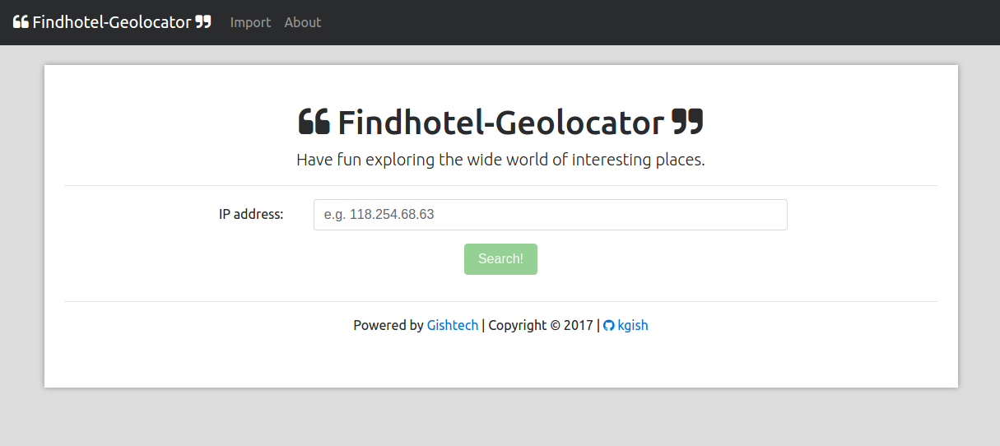
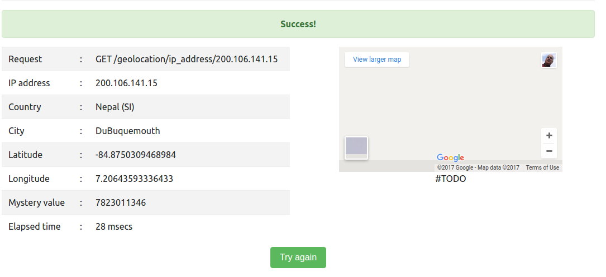
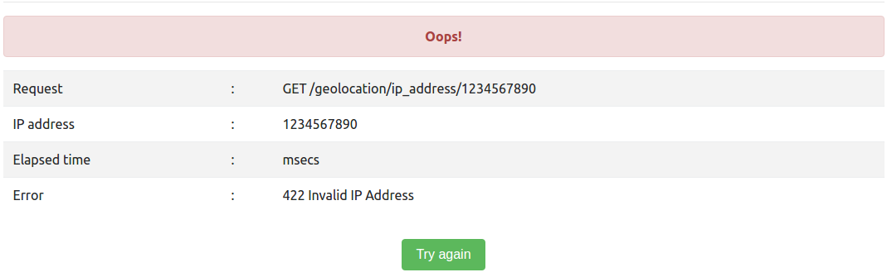
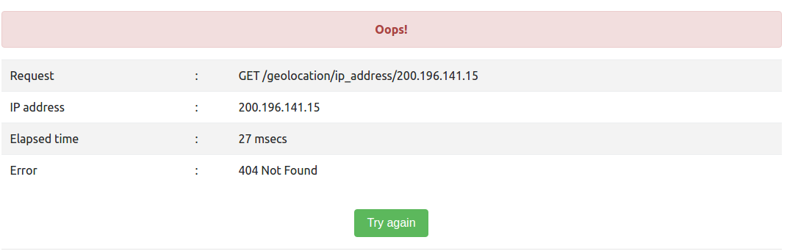
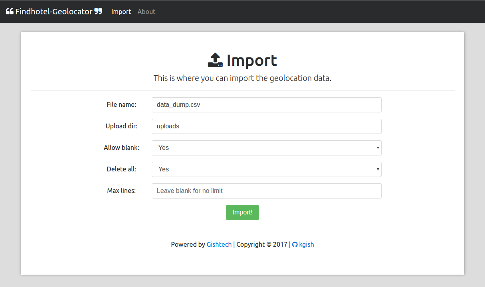
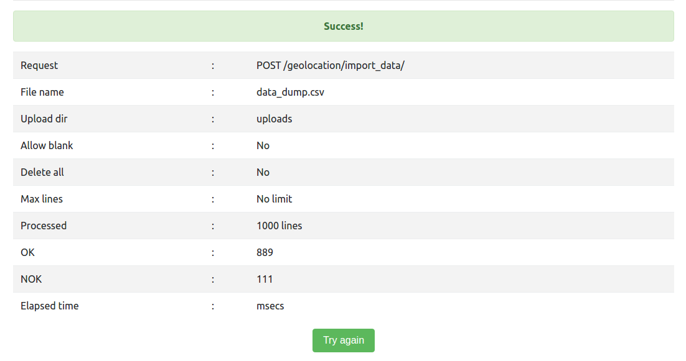
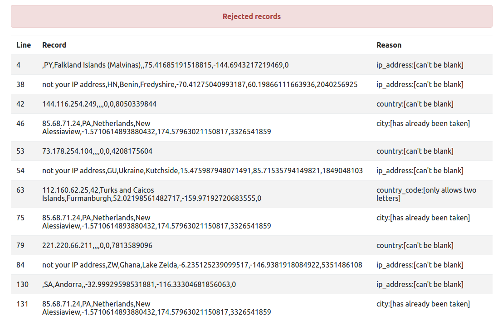
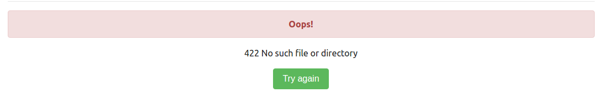

# Geolocation gem

Here is a technical description covering the most important aspects of the geolocation gem, e.g. how you can easily install it right away, or if you prefer how to build everthing from scratch from start to end.


## Installation

The installation is straighforward.

```shell
$ git clone https://github.com/kgish/findhotel-geolocation-gem.git path-to-plugins/geolocation
```

Add this line to your application's `Gemfile`:

```ruby
gem 'geolocation', path: 'path-to-plugins/geolocation'
```

Finally, you'll need to include the new gem in the bundle:

```shell
$ bundle install
```

An example demo is available on Heroku by visiting the following link:

```
https://findhotel-geolocator-demo.herokuapp.com/
```


## Create plugin

In this section I will describe how I built the geolocation gem from scratch as well as the motivations behind my decisions.

First of all create the initial plugin.

```shell
$ rails plugin new geolocator --mountable --database=postgresql
$ cd geolocator
```

From now on it will be assumed unless otherwise specified that you are running commands from the plugin root directory.


## Migration

Generate the `Location` model and associated scaffolding:

```shell
$ bin/rails generate scaffold location ip_address:inet country_code:string country:string \
    city:string latitude:float longitude:float mystery_value:string
```

Add indexes and modify the migration script so that it looks something like this:

```
class CreateGeolocationLocations < ActiveRecord::Migration[5.0]
  def change
    create_table :geolocation_locations do |t|
      t.inet :ip_address
      t.string :country_code
      t.string :country
      t.string :city
      t.float :latitude
      t.float :longitude
      t.integer :mystery_value, limit: 8
    end
    add_index :geolocation_locations, :ip_address
    add_index :geolocation_locations, [:country_code, :country, :city], unique: true, \
        name: 'index_geolocation_locations_on_cccc'
  end
end
```

**Motivations**:

* Type `inet` is supported by postgresql.
* The 'ip_address` column is indexed to speed up queries since the IP address is used for searching the database.
* Also I index on a unique multi-column contraint for country_code, country and city assuming that the combination of these three values must be unique (first come first serve during the data import).
* Had to implement a user-defined name `index_geolocation_locations_cccc` for the geolocation_locations index in order to avoid the name too long error.

Now we can run the migration:

```script
$ bin/rails db:create
$ bin/rails db:migrate
```


## Models

### Location model

In the `app/models/geolocation/location.rb` file:

```
module Geolocation
  class LatitudeValidator < ActiveModel::Validator
    def validate(record)
      if !record.latitude.blank? && (record.latitude < -90 || record.latitude > 90)
        record.errors[:latitude] << 'must lie between -90 and +90'
      end
    end
  end

  class LongitudeValidator < ActiveModel::Validator
    def validate(record)
      if !record.longitude.blank? && (record.longitude < -180 || record.longitude > 180)
        record.errors[:longitude] << 'must lie between -180 and +180'
      end
    end
  end

  class Location < ApplicationRecord
    include ActiveModel::Validations
    validates_with LatitudeValidator
    validates_with LongitudeValidator

    validates :ip_address, :country, presence: true
    validates :latitude, :longitude, :mystery_value, presence: true, allow_blank: true
    validates :country_code,
        format: { :with => /\A[A-Z][A-Z]\z/i, message: 'only allows two letters' },
        allow_blank: true
    validates :city, uniqueness: {scope: [:country_code, :country]}, allow_blank: true
  end
end
```

**Motivations**:

* ip_address MUST be a valid inet value
* ip_address and country MUST be present
* combination [country_code, country, city] is unique
* longitude and latitude may be missing but when present must have a value within legal range
* country_code MUST contain exactly 2 letters
* other attributes may be missing


## Controllers

### Application controller

In the `app/controllers/geolocation/application_controller.rb` file I've defined the `render_json_error` method which can be inherited all controllers extending it:

```ruby
module Geolocation
  class ApplicationController < ActionController::Base
    protect_from_forgery with: :exception

    def render_json_error(message, status)
      render json: { errors: [message] }, status: status
    end
  end
end
```

### Locations controller

In the `app/controllers/geolocation/locations_controller.rb` file:

```ruby
module Geolocation
  class LocationsController < ApplicationController

    # GET /locations
    def index
      @locations = Location.all
    end

    # GET /locations/1
    def show
    end

    # GET /ip_address/:id
    def ip_address
        ...
    end

    # POST /import_data
    def import_data
        ...
    end
 end
end
```

The `import_data` will parse the CSV data file and insert the valid non-duplicate entries into the data store, and when completed returns a complete report in json format:

```ruby
render json: {
    import_data: {
        file_name: file_name,
        upload_dir: upload_dir,
        allow_blank: allow_blank,
        delete_all: delete_all,
        max_lines: max_lines,
        stopwatch: {
            started: start.to_s,
            finished: now.to_s,
            elapsed: elapsed.to_s
        },
        records: {
            total: line,
            ok: line - nok,
            nok: nok,
            errors: errors
        }
    }
}
```

where `errors` is a collection of all the rejected entries and has this format:

```ruby
{
    line: line,
    values: location_hash.values.join(','),
    messages: e.record.errors.messages
}
```

In the `app/lib/geolocation/engine.rb` file, I have the gem push migrations to the application migrations list:

```
module Geolocation
  class Engine < ::Rails::Engine
    isolate_namespace Geolocation

    initializer "geolocation", before: :load_config_initializers do |app|

      ...

      # Push all engine migration files into base application migrations list
      config.paths["db/migrate"].expanded.each do |expanded_path|
        Rails.application.config.paths["db/migrate"] << expanded_path
      end
    end

  end
```

**Motivations**:

* it is easier to be able to run the migrations as usual from the application root directory.
* the application will generate an error on startup if this has accidentally been forgotten.

In the `app/config/routes.rb` file:

```
Geolocation::Engine.routes.draw do
  resources :locations, only: ['index', 'show']
  get '/ip_address/:ip_address' => 'locations#ip_address', as: 'ip_address', \
      constraints: { :ip_address => /[^\/]+/ }
  post '/import_data' => 'locations#import_data'
end
```

**Motivations**:

* the `constraints` modifier is used in order to allow dots (.) to appear in the passed `:id` parameter.
* explicily named the GET /ip_address route with an `as: 'ip_address'` so that I can use `ip_address_url` in the tests (see below).

In the `app/lib/geolocation/engine.rb` file, I have the gem mount itself in the application routes:

```
module Geolocation
  class Engine < ::Rails::Engine
    isolate_namespace Geolocation

    initializer "geolocation", before: :load_config_initializers do |app|

      # Let engine mount itself.
      Rails.application.routes.append do
        mount Geolocation::Engine, at: "/geolocation"
      end

      ...

    end
  end
end
```

**Motivations**:

* it should not be necessary for the application `routes.rb` file to have to be edited manually but rather it should be automatic.


## Configuration

In the `app/lib/geolocation/engine.rb` file, I define a `configuration` accessor like this:

```ruby
 class << self
    attr_accessor :configuration
  end

  def self.configure
    self.configuration ||= Configuration.new
    yield(configuration)
  end

  def self.reset
    self.configuration = Configuration.new
  end

  class Configuration
    attr_accessor :enabled
    attr_accessor :file_name
    attr_accessor :upload_dir
    attr_accessor :allow_blank
    attr_accessor :delete_all
    attr_accessor :max_lines

    # Default values
    def initialize
      @enabled = true
      @file_name = 'data_dump.csv'
      @upload_dir = 'uploads'
      @allow_blank = false
      @delete_all = true
      @max_lines = 0
    end
  end
```

In the application, this values can be modified by including an `app/config/initializer/geolocation.rb` file that looks like this (defaults listed):

```ruby
if defined? Geolocation
  Geolocation.configure do |config|
    config.enabled = true
    config.file_name = 'data_dump.csv'
    config.upload_dir = 'uploads'
    config.allow_blank = true
    config.delete_all = true
    config.max_lines = 0
  end
end
```

Where:

* `enabled` means on/off (not yet implemented)
* `file_name` is the name of the import data file
* `upload_dir` is the directory where the file is located
* `allow_blank` means that country_code, city, latitude and/or longitude may be empty (not yet implemented)
* `delete_all` means that the location table is emptied before the import starts
* `max_lines` means limit the import to this number of lines


## Testing

I use good old Minitest for verifying that the gem is working properly, namely by executing the commands:

```shell
cd test/dummy
bin/rails app:test
```

The following tests are present:

* `test/models/geolocation/location_test.rb` - valid? and errors for :ip_address, :country_code, :country, :city, :latitude, :longitude, :mystery_value and unique constraints.
* `test/controllers/geolocation/locations_controller_test.rb` - index, show, ip_address and import_data for :success, :not_found and :unprocessable_entity.
* `test/integration/geolocation/configuration_test.rb` for all settings

If everything works according to plan, you should see something like this (fingers-crossed):

```
Run options: --seed 24560

# Running:

...............................

Finished in 0.506299s, 61.2287 runs/s, 134.3080 assertions/s.

31 runs, 68 assertions, 0 failures, 0 errors, 0 skips
```


## Rails application

I chose Ruby on Rails and Ember which are wonderful front- and back-end frameworks for building responsive demo applications. For more details I invite to have a look at my github [Ember, Rails and JSON API ](https://github.com/kgish/ember-rails-template) repositiory.

### Geolocation

On the home page you can enter an IP address and (hopefully) receive the matching location, otherwise an error is shown (invalid or not found).



On success:

```
GET /geolocation/ip_address/200.106.141.15
```

Response:

```
{
  "location": {
    "id": 20173,
    "ip_address": {
      "family": 2,
      "addr": 3362426127,
      "mask_addr": 4294967295
    },
    "country_code": "SI",
    "country": "Nepal",
    "city": "DuBuquemouth",
    "latitude": -84.8750309468984,
    "longitude": 7.20643593336433,
    "mystery_value": 7823011346
  }
}
```

Screenshot:



On error invalid:

```
GET /geolocation/ip_address/1234567890
```

Response:

```
{
  "errors": [
    "422 Invalid IP Address"
  ]
}
```

Screenshot:



On error not found:

```
GET geolocation/ip_address/200.196.141.15
```

Response:

```
{
  "errors": [
    "404 Not Found"
  ]
}
```



### Data import

The data import can also be initiated from the import page:



On success:

```
POST {} /geolocation/ip_address/import_data
```

Response:

```
{
  "import_data": {
    "file_name": "data_dump.csv",
    "upload_dir": "uploads",
    "allow_blank": true,
    "delete_all": true,
    "max_lines": 0,
    "stopwatch": {
      "started": "2017-04-19 15:23:11 +0200",
      "finished": "2017-04-19 15:23:16 +0200",
      "elapsed": "5.016864677"
    },
    "records": {
      "total": 1000,
      "ok": 889,
      "nok": 111,
      "errors": [
        {
          "line": 4,
          "values": ",PY,Falkland Islands (Malvinas),,75.4168...,-144.6943...,0",
          "messages": {
            "ip_address": [
              "can't be blank"
            ]
          }
        },
        ...
        {
          "line": 46,
          "values": "85.68.71.24,PA,Netherlands,New Alessiaview,-1.5710...,174.5796...,332...",
          "messages": {
            "city": [
              "has already been taken"
            ]
          }
        },
        ...
      ]
    }
  }
}
```




Rejected records:




On error no such file or directory:

```
POST { file_name: 'missing-file.csv'} /geolocation/ip_address/import_data
```

Response:

```
{
  "errors": [
    "422 No such file or directory"
  ]
}
```




## Heroku deployment

According to the assignment, I should deploy the project on a cloud platform of your choice. I have chosen Heroku because I have much experience deploying Rails applications there.

In order for the following to work properly, ensure that you've added the following lines (see above) to your `Gemfile`:

```
gem 'ember-cli-rails'
```

To configure your EmberCLI-Rails applications for Heroku:

```shell
$ bundle exec rails generate ember:heroku
$ git add .
$ git commit -m"Ran rails generate ember:heroku"
```

Make sure that you have heroku installed and then you can create the application:

```shell
$ heroku create findhotel-geolocator-demo
```

Add the NodeJS buildpack and configure NPM to include the bower dependency's executable file.

```shell
$ heroku buildpacks:clear
$ heroku buildpacks:add --index 1 heroku/nodejs
$ heroku buildpacks:add --index 2 heroku/ruby
$ heroku config:unset SKIP_EMBER
```

You are ready to deploy:

```shell
$ git push heroku master
```

and fire it up:

```shell
$ heroku open
```

The url is:

```
https://findhotel-geolocator-demo.herokuapp.com/
```


## Dockerization

According to the code challenge, the REST API application (that uses the aforementioned gem) should be Dockerised and the Dockerfile should be included in the solution.

I must be frank that I do not have extensive experience with Docker beyond the basics, and this has proven to be quite a challenge for me. However, undaunted and eager to try thing out anyway this is as far as I got.

### Application

### Database

```shell
$ curl -d '{"file_name":"data_dump_org.csv"}' -H "Content-Type: application/json" \
    -X POST http://localhost:3000/location/import_data >import_data.log
```

Create a Dockerfile as explained in [Dockerize PostgreSQL](https://docs.docker.com/engine/examples/postgresql_service/).

Build an image from the Dockerfile assign it a name.

```shell
$ sudo docker build -t geolocation_postgresql .
```

Run the PostgreSQL server container (in the foreground).

```shell
$ docker run --rm -P --name findhotel_geolocation_db geolocation_postgresql
```

List info.

```
$ sudo docker ps
CONTAINER ID        IMAGE                    COMMAND                  CREATED             STATUS              PORTS                     NAMES
bb100b4e5171        geolocation_postgresql   "/usr/lib/postgres..."   6 seconds ago       Up 4 seconds        0.0.0.0:32772->5432/tcp   findhotel_geolocation_db

```

Connect and login.

```shell
$ psql -h localhost -p 32772 -d docker -U docker --password
docker=#
```

I am eager to learn more.


## TODO

Unfortunately, I do not have alot of spare time lately, so for the sake of completeness I have listed here those items of the code challenge which I was unable to complete and must end up on the much dreaded todo list.

* DB configuration - although I've made the gem configurable (see above) I was not able to make it DB configurable.
* Containers - using the standard Heroku environment for Rails applications, I did not make full use of the dockerized containers.
* Plugin autoloading - currently the user has to add the gem to the `Gemfile` and run bundle install, rails db:create and rails db:migrate manually. Better would be to use a mechanism to load all gem engines in the `/plugins' directly automatically.
* Thin controller - the locations controller is slightly bloated: the `ip_address` and `import_data` methods should either call private methods or use helper modules.
* Rake task - the data import can be moved to a helper module and parameterized so that for instance it can be used in watchful mode and/or crontab for importing data whenever the file changes or at certain times as night.


## License
The gem is available as open source under the terms of the [MIT License](http://opensource.org/licenses/MIT).


## Author

Kiffin Gish \< kiffin.gish@planet.nl \>

\- You're never too old to learn new stuff.
